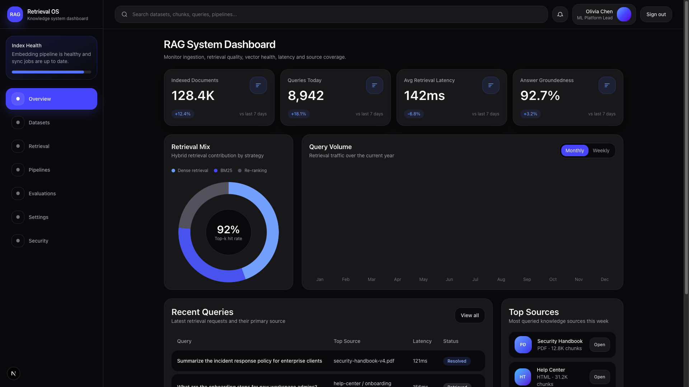

# Next.js 16 + Strapi 5 (Simple Auth)

Simple full-stack project with:
- Hero section
- Register
- Login
- Dashboard
- Sign out

## Tech Stack

- Frontend: Next.js 16, React 19, Tailwind CSS
- Backend: Strapi 5
- Auth: Strapi Users & Permissions + JWT cookie in Next.js
- Database: SQLite (default Strapi setup)

## Project Structure

```text
.
├── frontend/   # Next.js app
└── backend/    # Strapi app
```

## Prerequisites

- Node.js 20+
- pnpm (recommended)

## 1) Install Dependencies

```bash
cd backend
pnpm install

cd ../frontend
pnpm install
```

## 2) Environment Variables

### Backend (`backend/.env`)

You can start from `backend/.env.example` and set real values:

```env
HOST=0.0.0.0
PORT=1337
APP_KEYS=...
API_TOKEN_SALT=...
ADMIN_JWT_SECRET=...
TRANSFER_TOKEN_SALT=...
JWT_SECRET=...
ENCRYPTION_KEY=...
```

### Frontend (`frontend/.env`)

```env
HOST=localhost
STRAPI_BASE_URL=http://localhost:1337
```

## 3) Run the Apps

Terminal 1:

```bash
cd backend
pnpm develop
```

Terminal 2:

```bash
cd frontend
pnpm dev
```

Frontend: `http://localhost:3000`  
Strapi Admin: `http://localhost:1337/admin`

## Strapi Setup (First Run)

1. Create an admin user in Strapi.
2. Go to Content Manager and create/update **Home Page**:
   - `title`
   - `description`
   - `sections` with one `modules.hero` block (`heading`, `subheading`, `link`, `image`)
3. In Settings -> Users & Permissions -> Roles -> Public:
   - Enable `find` for `home-page` so the hero can be fetched publicly.

## App Routes

- `/` -> Hero page
- `/sign-up` -> Register form
- `/sign-in` -> Login form
- `/dashboard` -> Protected dashboard page

## Auth Behavior

- Successful register/login stores `jwt` in an HTTP-only cookie.
- `/dashboard` requires a valid session.
- Authenticated users are redirected away from `/sign-in` and `/sign-up`.
- Dashboard includes a **Sign out** action that clears the session cookie.

## Notes

- This is intentionally a small demo project.
- Main logic is in:
  - `frontend/actions/auth.ts`
  - `frontend/proxy.ts`
  - `frontend/lib/strapi.ts`

Made with love ❤️ by Elliot 👨‍💻
